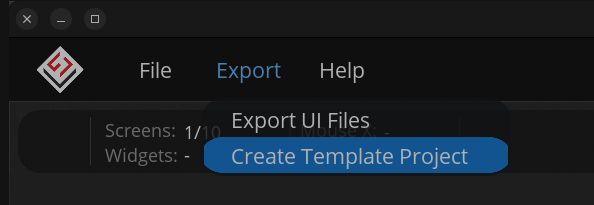
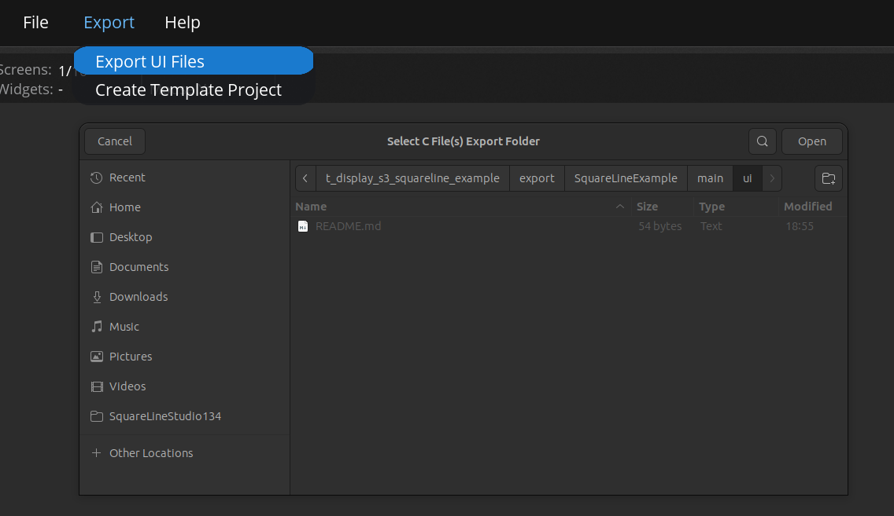

# Go-Display-S3

# Overview
This is a template ESP-IDF project for LilyGO [T-Display S3](https://github.com/Xinyuan-LilyGO/T-Display-S3).
T-Display-S3 is an ESP32-S3 board with an integrated LCD display.
This code follows a similar structure to the code provided in [esp-bsp](https://github.com/espressif/esp-bsp) repo.

## Tested Hardware & Software Framework(s)
* LilyGO T-Display S3 [v1.2] (non-touch)
  * ESP-IDF Version 5.3.x ([master branch](https://github.com/espressif/esp-idf))
  * LVGL 8.4.0
  * Squareline Studio 1.5

## Capabilities

This project demonstrates the following capabilities:

* Configure the ST7789 display using the I80 Bus
  * Screen orientation is landscape where the buttons are facing towards the left
* Showing a simple UI interfce, calendar on the t-display-s3 display
* Button readout using [espressif/button](https://components.espressif.com/components/espressif/button)

## sdkconfig

There are some sdkconfig options that needs to be set, I've included these in a [sdkconfig.defaults](./sdkconfig.defaults) file.
  * I haven't done anything fancy with the partition table, I'm simply using one of the default `PARTITION_TABLE_SINGLE_APP_LARGE`.
  * You can easily benchmark/stress test the display by setting `CONFIG_LV_USE_DEMO_BENCHMARK` or `CONFIG_LV_USE_DEMO_STRESS` options.
  * LVGL FPS/CPU Usage overlay can be disabled with `CONFIG_LV_USE_PERF_MONITOR=n`.

## Notes on LVGL and Memory Management

LVGL and display driver parameters have been set to utilize the SPI RAM. Performing a LVGL benchmark, I managed to get over 100 FPS.
According to the [ST7789 datasheet](https://www.rhydolabz.com/documents/33/ST7789.pdf), I think you should aim for 75 FPS.

## Notes on Display Framerate
Display framerate can be affected by many factors. During my testing I found that the `LVGL_BUFFER_SIZE` and `LCD_PIXEL_CLOCK_HZ` plays a key factor.

In my opinion, `LVGL_BUFFER_SIZE` should remain as is (1/10th of the display size in pixels) while the `LCD_PIXEL_CLOCK_HZ` can be tweaked.

The [ST7789 datasheet](https://www.rhydolabz.com/documents/33/ST7789.pdf) mentions a maximum pixel clock of 17 MHz `(17 * 1000 * 1000)`
but you may/may not experience issues with a high clock speed due to PSRAM banwidth (source: [ESP-FAQ Handbook](https://docs.espressif.com/projects/esp-faq/en/latest/esp-faq-en-master.pdf) [end of page 79]).

## SquareLine Studio

### Create a new SquareLine Project

1. Create a new SquareLine Project using the board created previously
   * I used the default theme settings
2. Once the new project is opened, click on _**Export -> Create Template Project**_
   
3. Export the `ui` files by clicking on  _**Export -> Export UI Files**_.
   * Make sure to select the previously exported project's `main/ui` directory
   
4. Save the project
